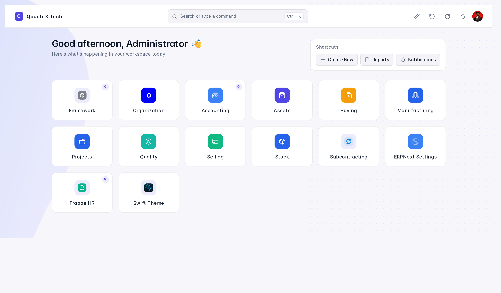
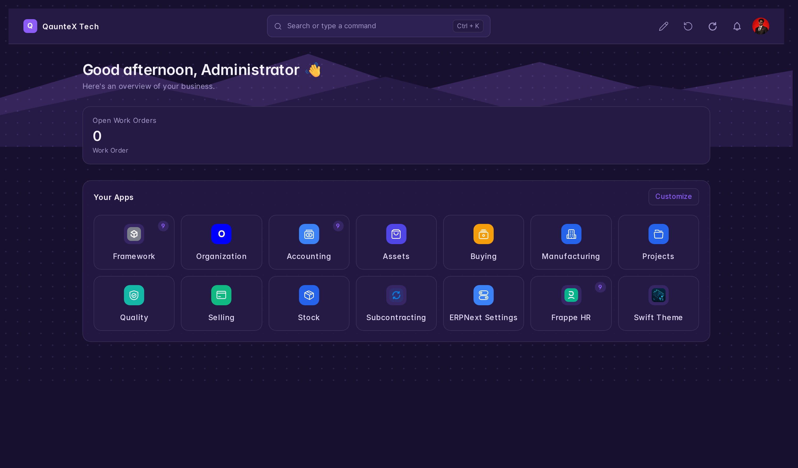
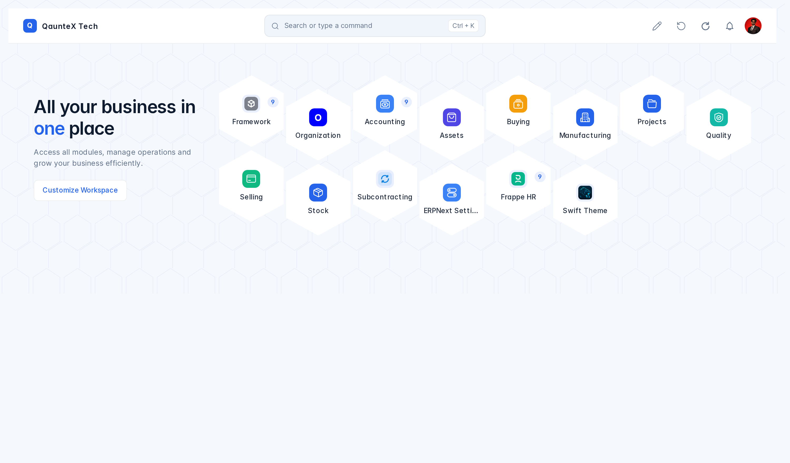
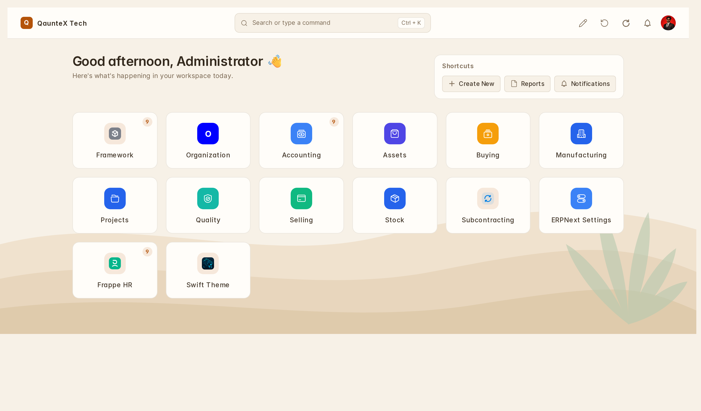
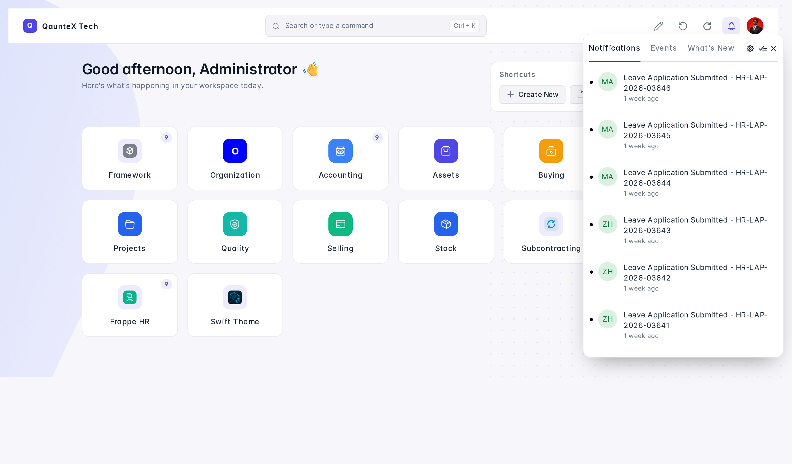
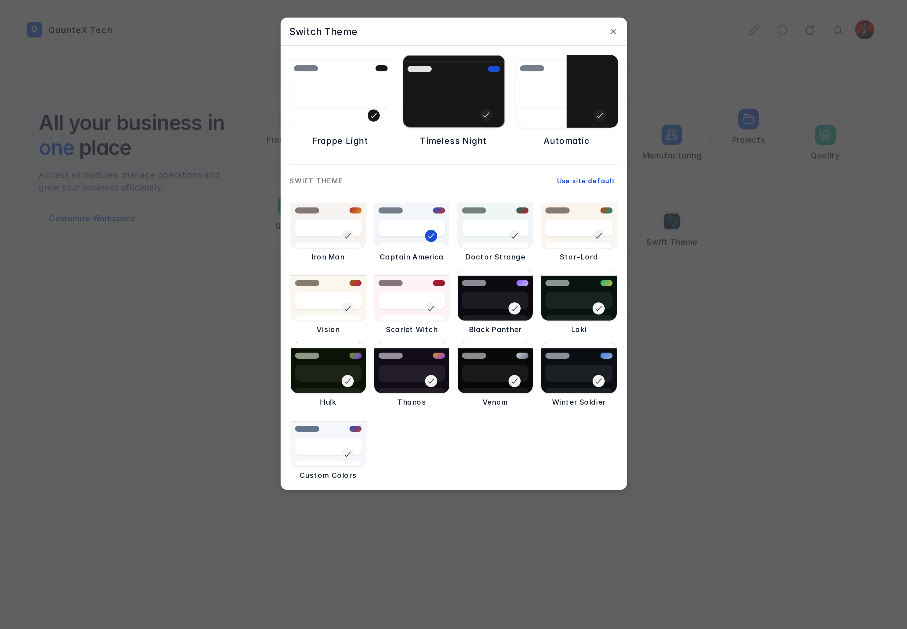
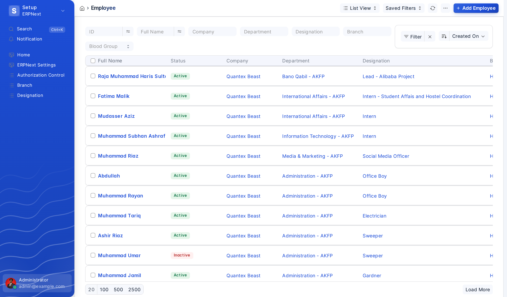
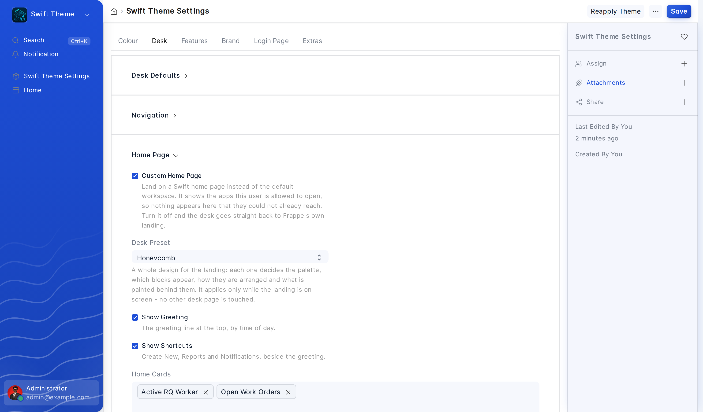

# Swift Theme

A theming layer for Frappe v16. It colours the whole desk — navbar, sidebar,
list, report, kanban, dashboards, forms, child tables, modals and the login
page — from one palette, and stays out of Frappe's way while doing it.

📖 **[Documentation](https://github.com/its-alikhokher/swift_theme/wiki)** —
installation, every setting explained, and troubleshooting.

## Themes

Twelve presets, six light and six dark, each a hand-tuned palette rather than
one hue tinting everything:

| Light | Dark |
|---|---|
| Iron Man · crimson + gold | Black Panther · violet |
| Captain America · navy + red | Loki · emerald + gold |
| Doctor Strange · teal + crimson | Hulk · lime + purple |
| Star-Lord · burnt orange + teal | Thanos · gold + purple |
| Vision · gold + magenta | Venom · monochrome |
| Scarlet Witch · rose + deep red | Winter Soldier · steel blue |

Every palette is checked against a 4.5:1 contrast floor before it ships, and
light and dark follow different rules — in dark, cards are lighter than the
page, because elevation there comes from light rather than shadow.

Each preset also brings its own **backdrop** behind the desk and its own accent
shapes on card headers and number cards, so switching preset changes more than
the hue. Two switches in Settings govern that: **Enable Backdrops** (on by
default) and **Show Backdrop Through Panels**, which makes cards and the sidebar
translucent so the background reads through the desk.

### Custom Colors

Give it a primary and a secondary colour and it works out the rest — canvas,
cards, the text for each surface, muted text, borders and accent states. Two
more choices it cannot read off a hex code:

- **Custom Mode** — Light or Dark
- **Colour Strength** — *Subtle* keeps cards neutral and puts the colour in the
  accents; *Bold* gives the cards the brand tone

If you pick a colour where neither black nor white is quite legible on it, it is
nudged a percent or two until one is.

## Switching theme

Presets appear inside Frappe's own **Switch Theme** dialog, drawn as the same
preview cards as Light / Dark / Automatic — reached from **Toggle Theme** in the
user menu. There is no separate chip of ours anywhere.

Any signed-in user may pick their own. Everything the dialog sets is written to
the caller's own User record, so a theme is a personal preference like a
language or a timezone; **Enable Theme Switcher** is the site-wide switch that
decides whether the presets are offered at all.

Saving Swift Theme Settings applies immediately in every open desk session.

## Also included

- **Login page** in three layouts (Split, Centered, Minimal), themed from the
  active palette and rendered server-side so it paints correctly on first load
- **Density, shape, font scale and family**, per user
- **Sounds** on desk events, configurable per event — no audio ships, so an
  event with no file attached keeps Frappe's own sound
- **Focus / reading mode**, a command palette, and a hide-the-sidebar toggle on
  Alt+B

### Desk home page

An optional landing that replaces the default workspace, in eight designs —
each one decides the palette, which blocks appear, how they are arranged and
what is painted behind them.

It is built on what the desk already knows: the tiles are
`frappe.boot.desktop_icons`, so nothing appears that the user could not already
reach; the figures are Number Cards, counted through the same permissions, so a
User Permission on company or territory narrows them without the page knowing
such a thing exists. Search, notifications and the user menu are Frappe's own
controls, forwarded rather than copied.

Its whole configuration rides on boot, so opening the desk costs no request of
its own and the page is complete on the first paint.

No images are shipped for any of the theming: it is CSS plus inline SVG, so
there is nothing extra to download.

## Screenshots

The same landing on **Eclipse** — figures across the top over a ridge line, and
the apps on a panel of their own:

**Honeycomb** is a different design, not a recolour: a headline beside a comb of
hexagonal tiles.

**Dune**, with the sand ridges and the plant in the corner:

Notifications are Frappe's own panel, opened by Frappe's own button and simply
placed under the bell — the same tabs, counts and actions as everywhere else:

All twelve colour presets sit inside Frappe's own Switch Theme dialog, drawn as
the same preview cards as Light / Dark / Automatic:

Every other page is the desk you know, themed — sidebar, filters, list chrome
and empty states included:

The landing is configured from one section: which design, what it shows, and
which Number Cards become its figures.

## Requirements

Frappe **v16** (`>=16.0.0,<17.0.0`) and Python 3.10 or newer.

Setup steps are in the
[wiki](https://github.com/its-alikhokher/swift_theme/wiki/Installation), which
also covers upgrading and uninstalling.

## Upgrading

Upgrades carry the site across on their own — nothing needs setting by hand.
The presets were renamed along the way, so a site that was on *Midnight Pro*
comes back as **Black Panther**; the full mapping is in
`patches/v1_0/rename_presets_to_marvel.py`.

## Contributing

[CONTRIBUTING.md](CONTRIBUTING.md) covers setup, the test suites, and the CSS
rules that exist because breaking them broke something real. Please report
security problems privately — see [SECURITY.md](SECURITY.md). Everyone taking
part is expected to follow the [Code of Conduct](CODE_OF_CONDUCT.md).

[REQUIREMENT.md](REQUIREMENT.md) records what the app is meant to do, including
the constraints that exist because something broke, and the
[wiki](https://github.com/its-alikhokher/swift_theme/wiki) is the user-facing
documentation.

## Licence

MIT
